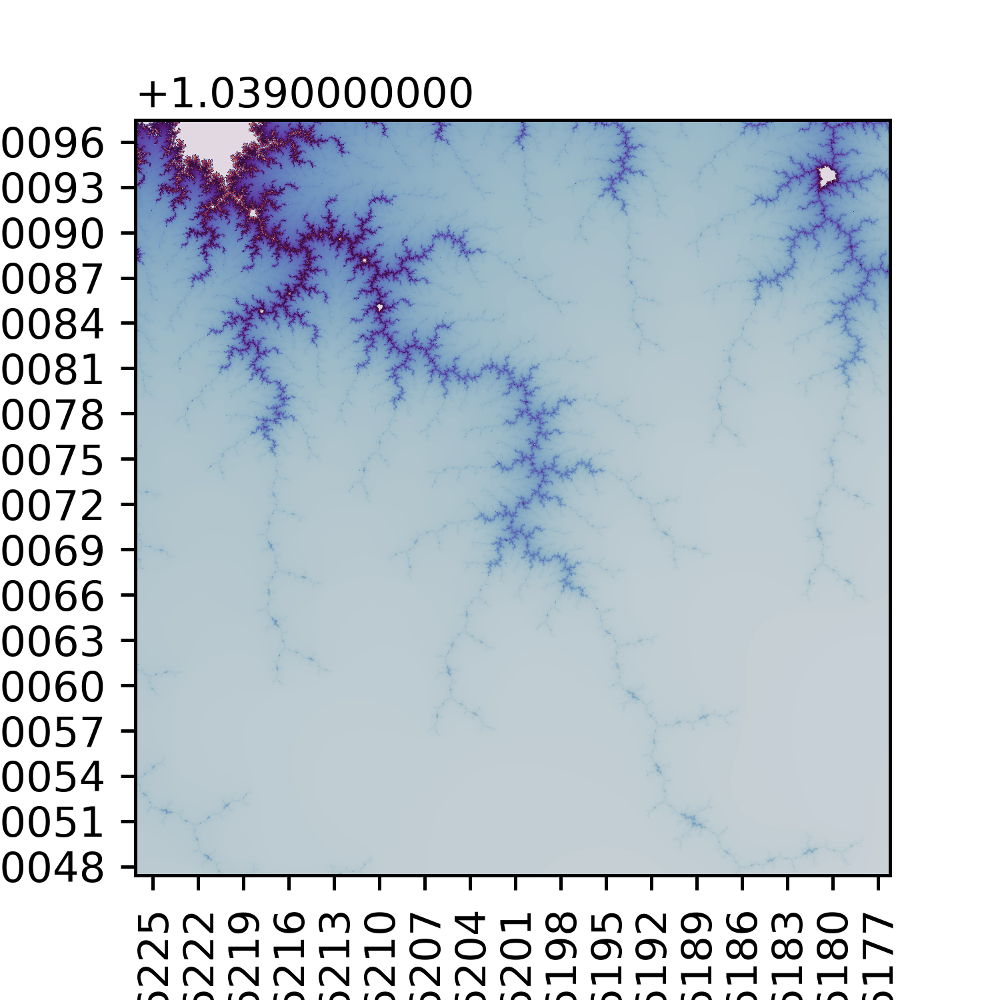

# Mandelbrot and Julia Set Plotting Functions

This Python code provides 2 functions, `mandelplot` and `Julia`, for plotting the [Mandelbrot](https://simple.wikipedia.org/wiki/Mandelbrot_set) and [Julia](https://en.wikipedia.org/wiki/Julia_set) set for a given range of the complex plane. It uses the Numpy, Matplotlib, and Numba libraries to calculate and plot the sets efficiently.

## Prerequisites

-   Python 3.6+
-   NumPy
-   Matplotlib
-   Numba

## Usage
```python

mandelplot(x, y, size, width, height, max_iters, cmap='twilight', dpi=450, save=True)
```

The function takes the following parameters:

-   `x`: The x-coordinate of the center of the plot.
-   `y`: The y-coordinate of the center of the plot.
-   `size`: The size of the plot in the complex plane.
-   `width`: The width of the plot in pixels.
-   `height`: The height of the plot in pixels.
-   `max_iters`: The maximum number of iterations to perform when computing the Mandelbrot set.
-   `cmap`: The colormap to use when plotting the Mandelbrot set (default is 'twilight').
-   `dpi`: The resolution of the plot in dots per inch (default is 450).
-   `save`: A boolean indicating whether to save the plot as a PNG file (default is True).
The plot will be displayed in the Python console and saved as a PNG file in the `fractal_images` directory with a filename based on the input parameters.

# Julia Set Plotter

This code generates a plot of the Julia set for a given range of the complex plane. The Julia set is a fractal set that arises from the iterative process of the equation `z = z**2 + c`, where `z` and `c` are complex numbers. The function `compute_julia` calculates the Julia set value for a given complex number using this iterative process.

## Dependencies

This code requires the following Python modules to be installed:

-   Python 3.6+
-   NumPy
-   Matplotlib
-   Numba

## Usage

To generate a plot of the Julia set, call the `julia` function with the following parameters:

-   `x`: The x-coordinate of the center of the plot.
-   `y`: The y-coordinate of the center of the plot.
-   `size`: The size of the plot in the complex plane.
-   `width`: The width of the plot in pixels.
-   `height`: The height of the plot in pixels.
-   `c`: The complex number to use in the iterative process (`z = z**2 + c`)
-   `max_iters`: The maximum number of iterations to perform when computing the Mandelbrot set.
-   `cmap`: The colormap to use when plotting the Mandelbrot set (default is 'twilight').
-   `dpi`: The resolution of the plot in dots per inch (default is 450).
-   `save`: A boolean indicating whether to save the plot as a PNG file (default is True).

The plot will be displayed in the Python console and saved as a PNG file in the `fractal_images` directory with a filename based on the input parameters.

*Notes:*
- The current implementations can only make square images, so width and height should be the same (they can differ, but the resulting image will always be square).
- The navigation with coordinates is a bit tricky, needs to be fixe

## Examples
#### Mandelplot
```python
# Plot the Mandelbrot set centered at (-0.162011870542194, -0.162011870542194) with size 0.0005 and resolution 1500x1500
mandelplot(-0.162011870542194, 1.039724435805453, 0.0005, 1500, 1500, 740, cmap='twilight', save=False)
```

##### Output:


#### Julia
```python
# Plot the Julia set centered at (0, 0) with size 1.2 and resolution 1500x1500
julia(0, 0, 1.2, 1500, 1500, -1.476 + 0.0j, 1000, cmap='inferno', save=False)
```
##### Output:
_inferno.png)

There's a set of precomputed 5500x5500 images in the `images` folder, and other interesting Julia c parameters to try can be found on the wikipedia page: https://en.wikipedia.org/wiki/Julia_set
